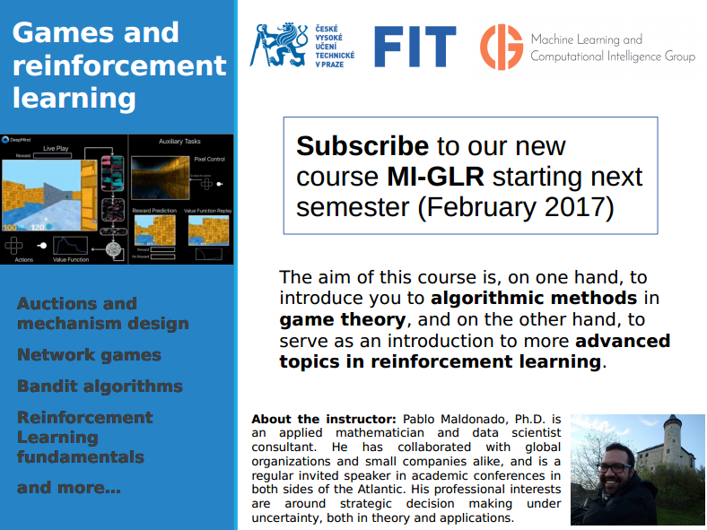

What is Reinforcement Learning?
===

#### Pablo Maldonado. 

---
# Purpose of this talk
- Provide a good motivation/survey of the main ideas.
- Demistify the hype.
- Present RL as a **framework** for decision-making under uncertainty.

--- 


--- 
# Vanity slide
- Freelance consultant (math/"data science").
- Lecturer:
	- CERGE-EI Economics Discovery Hub.
	- Czech Technical University (FIT).
- PhD math (mathematical game theory), Universite Paris VI.
- **First attendant to the first Machine Learning Meetup in Prague.**

---
# The Reinforcement Learning Problem

- An **agent** learns by interaction with the **environment** to perform a **goal**.
- More *realistic* and *ambitious* than other kinds of machine learning (supervised learning). 


--- 
# Demo: treasure_on_right.py


---
# Where does it come from?
- Learning in animal psychology (Edward Thorndike, 1911).
- Optimal Control and Dynamic Programming (1950's, but core ideas from 18th century).
- Operations Research / Economics.
- Robotics.


---

# Some RL success stories

- Learned the world's best player of Backgammon (Tesauro, 1995).
- **Acrobatic helicopter autopilots** (Ng, Abbeel, Coates et al 2006+).
- Used for **strategic decision-making** in *Jeopardy!* (IBM's Watson, 2011).
- **Human-level performance** on Atari games from pixel input, borrowing deep learning methods (Google Deepmind, 2015).
- **40% reduction** of Google's Data Center Cooling Bill


---
# The two faces of RL
- Model-Based RL:
	- A description of the environment is available (will be made precise soon).	
- Model-Free RL:
	- No need of having a model.

## Wait, what's a model anyway?
- A **model** is a representation of the environment on which the agent lives.

---
Markov Decision Processes
===

---
A **Markov decision process (MDP)** is a tuple $\left <\mathcal S, \mathcal A,  \mathcal P, \mathcal R, \gamma \right >$ where

- $\mathcal S$ is a finite set of states.
- $\mathcal A$ is a finite set of actions.
- $\mathcal P$ is a state-action transition probability matrix,
	- $\mathcal P^a_{s,s'} = \mathbb P (S_{t+1} = s \ | \ S_t = s, A_t = a).$
- $\mathcal R$ is a reward function 
	- $\mathcal R^a_s = \mathbb E (R_{t+1} \ | \ S_t = s, A_t = a)$
- $\gamma$ is a **discount factor**, $\gamma \in [0,1]$.


---
# Payoff
Associated to a **history** 
$$(s_1,a_1,r_1, s_2, a_2, r_2, \ldots , s_t, a_t, r_t, S_{t+1}, A_{t+1},R_{t+1}, \ldots)$$
there is a to-go payoff:
 $$G_t = R_{t+1}+\gamma R_{t+2}+\gamma^2R_{t+3}+\ldots$$


---
# Example: Student MDP


---
# Policies 

A (stationary) **policy** $\pi$ is a distribution over actions given states, 

$$\pi(a \ | \ s) := \mathbb P(A_t = a \ | \ S_t = s).$$ 


---
# State-value function

- The **state-value function** $V_\pi(s)$ of an MDP is the expected return starting from state $s$, and then following policy $\pi$:
$$ V_\pi(s) =\mathbb E (G_t \ | \ S_t =s)$$

---
# State-action value function
- The **state-action value function** $Q_\pi(s,a)$ is the expected return starting from state $s$, taking action $a$ and then following policy $\pi,$

$$Q_\pi(s,a) = \mathbb E_\pi (G_t \ | \ S_t = s, A_t = a).$$


---
# Solve an MDP
- **Solve** means answering the question *what shall I do in each state to maximize my expected discounted reward?*.
- We use the knowledge of the environment for **prediction** of a policy, and **control** (optimize such policy).
	- **Prediction** means evaluation of the policy (how would the trajectories look like).
	- **Control** means finding the best policy.


---
# Optimal value functions

- The **optimal state-value function** $V_*(s)$ is the maximum over all policies:

	$$V_*(s) = \max_\pi V_\pi(s).$$

- The **optimal state-action-value function** $Q_*(s,a)$ is the maximum over all policies:
 $$ Q_*(s,a) = \max_\pi Q_\pi(s,a).$$


---
# Finding optimal policies
An optimal policy can be found maximizing over $Q_*$:

$$ \pi_*(a \ | \ s) = 1 \text{ if } a \in \mathrm{argmax} \ Q_*(s,a) \text{ else 0} .$$ 

---
# Bellman Equation

$$V_*(s)  =  \max_{a \in \mathcal A}\left\{ \mathcal R^a_s + \gamma\sum_{s' \in \mathcal S}\mathcal P^a_{ss'}V_*(s')\right \}$$

A similar relation holds for the $Q_*$ function since

$$V_*(s) = \max_{a \in \mathcal A}Q_*(s,a).$$


---
# Model-Based Control: Value Iteration.

#### Idea: 
Use the optimality equation:

$$V_*(s)  =  \max_{a \in \mathcal A}\left\{ \mathcal R^a_s + \gamma\sum_{s' \in \mathcal S}\mathcal P^a_{ss'}V_*(s')\right \}$$

to get a sequence:

$$V_{k+1}  \leftarrow \max_{a \in \mathcal A}\left\{ \mathcal R^a_s + \gamma\sum_{s' \in \mathcal S}\mathcal P^a_{ss'}V_k(s')\right \}$$


---
# Model-Based Control: Policy Iteration.

- Given policy $\pi:$
	- **Evaluate** $\pi$, that is, calculate $Q_\pi$.
	- **Improve** the policy by being $\epsilon$-**greedy** with respect to $v_\pi$ and/or $Q_\pi$. 
	- Update and repeat.


--- 
# Why $\epsilon$-greedy?
- *Greedy in the Limite with Infinite Exploration* (GLIE).
- Exploration vs Exploitation dilemma.
- Having a positive chance to visit infinitely often the state-action combinations rules out the chance of missing out anything important.
    
---
Planning by Learning the model
===

--- 
# What's a model?
- A model is a representation of the environment on which the agent lives.
- $\mathcal M = \left < \mathcal P, \mathcal R \right >$
- Learn the model first, optimize accordingly later.
- **Planning** means optimizing policy choice; **learning** means understanding the environment.


---
# How can we do that?
- Learning $s,a \mapsto r$ is a **supervised learning problem**.
- Learning $s,a \mapsto s'$ is a **density estimation problem**.

---
# Table lookup model
- Count visits $N(s,a)$ to each state-action pair.
- $\hat{\mathcal P}^a_{s,s'} = \frac{1}{N(s,a)}\sum 1_{S_t = s, A_t=a, S_{t+1}=s'}$
- $\hat{\mathcal R}^a_s = \frac{1}{N(s,a)}\sum 1_{S_t = s, A_t = a}R_t$


---
# Planning with a model
- Get an approximation of the model $\hat{\mathcal M}$.
- Use your favorite planning algorithm:
	- Value iteration
	- Policy iteration
	- Tree search

---
# What could possibly go wrong?
- Continuous state/action spaces.
- Large problems become quickly intractable.
- It's not hopeless, though... there are ways around in many cases. Usually requires domain knowledge to narrow down the problem from the theory side.

---
Model-Free RL
===

---
# GLIE Monte-Carlo Control
- Sample an episode using policy $\pi$
- For each state $S_t$ and action $A_t$ in the episode, 

$$ \begin{aligned}
N(S_t,A_t) & \leftarrow & N(S_t, A_t) + 1 \\
Q(S_t, A_t) & \leftarrow & Q(S_t, A_t) + \frac{1}{N(S_t,A_t)}(G_t-Q(S_t,A_t))
\end{aligned}$$
	
- Improve the policy based on the new state-action-value function
	- $\epsilon \leftarrow 1/k$
	- $\pi \leftarrow \epsilon-\text{greedy}(Q)$


---
# Demo: 
https://gym.openai.com/evaluations/eval_13s9iRXQcG0oaZ1DkN7g

---
# Temporal Difference Learning
- Drawback of MC: you wait until you die to update your experience.
- Break up the episode and learn directly from the experience, not wait until the end.


---
# On-Policy Learning: Sarsa


---
# Demo:
https://gym.openai.com/evaluations/eval_HmYHTSY5QYOkl77yacPLkg


---
# Off-Policy Learning: Q-Learning


---
# Demo: Frozen Lake
https://gym.openai.com/evaluations/eval_j8yzfQ4BQ9O6dI5Pr7SrtQ


--- 
# On and Off-Policy Learning
- **On-policy learning:**
	- "Learn on the job"
	- Learn about $\pi$ by sampling experience from $\pi$.

- **Off-policy learning:**
	- "Shadow" someone. 
	- Learn about policy $\pi$ from experience sampled from policy $\pi'$.
	- Learn about *optimal* policy while following an *exploratory* policy.


---
# What's the difference here?
- Sarsa can learn from the experience several steps ahead.
	- Sarsa($\lambda$): record the future reward from a bigger part of the future path.
- Q-Learning learns from the experience just one step ahead.


---
# What could possibly go wrong this time?
- Not really useful to solve really **really large** problems:
	- Backgammon: $10^{20}$ states.
	- Computer Go: $10^{170}$ states.
	- Chess: $10^{120}$ states.
	- Helicopter flying: continuous state space.
	- Atoms in the observable universe: $10^{81}$.


---
Function Approximation
===


---
# How can we solve large problems effectively?

- **Function approximation**
- The goal is to find a parameter vector $\theta$ such that

$$\hat{Q}(s,a,\theta) \approx Q(s,a)$$

- $\theta$ might be, for instance:
	- Weights in a neural network.
	- Coefficients for a linear regression model.
	
---
# Motivation: Cart-Pole

- https://gym.openai.com/envs/CartPole-v0
- https://openai.com/requests-for-research/#cartpole
- State: 4 parameters
- Action: move left or right.nt.
- Reward: +1 for not bending the pole too much, and not moving far from the center.
- An episode is solved if you get 200 points.

---
# Random search
```python
    # Random search
    for _ in range(n_episodes):
        counter += 1
        weights = 2*np.random.rand(4)-1
        ep_reward = run_episode(env, weights)
        
        if ep_reward > best_ep_reward: 
            best_weights = weights
            best_ep_reward = ep_reward
    
            if ep_reward == 200:
                break
```

--- 
# Demo: cart_pole_random.py

--- 
# Random search: Iterations needed to win


--- 
# Hill climbing
```python
'''Hill-climbing algorithm for training''' 

    for _ in range(n_episodes):
        counter+=1
        weights_update = best_weights+ \
        			alpha*(2*np.random.rand(4)-1)
        ep_reward = run_episode(env,weights_update)
        if ep_reward > best_ep_reward:
            best_ep_reward = ep_reward
            best_weights = weights_update
        if ep_reward == 200:
            break 
```

---
# Demo: cart-pole-hill-climb.py

---
# Hill climbing: Iterations needed to win


---
# Why so bad? 
- Random search jumps all over the place. 
- Hill-climbing can get stuck if you are in a region where the improvement is insignificant.

---
# Neural networks: Iterations needed to win

- Around 100 episodes to reach 200 points, 1 hidden layer with 20 nodes.
(no picture, I'm impatient...)

---
# Function backups
- DP: $s \mapsto \mathcal R^a_s + \gamma\sum_{s' \in \mathcal S}\mathcal P^a_{ss'}\cdot  \max_{a' \in \mathcal A}\hat{q}(s',a',\theta)$
- Monte-Carlo: $s \mapsto G_t = R_{t+1}+\gamma R_{t+2}+\gamma^2R_{t+3}+\ldots$
- TD: $s \mapsto R_{t+1}+\gamma \hat{Q}(S_{t+1},A_{t+1}\theta)$


--- 
- In general, we have something of the form $s \mapsto g$, where $g$ is some target value.
	- Up to now, trivial updates: move the estimated value "a bit more" towards $g$.
	- Viewing each backup as a *training example* we can use any **supervised learning** method to estimate the value function.
 	
---
# Error functional
- **Goal**: Find a parameter $\theta$ that minimizes:
$$J(\theta) := \frac{1}{2}\sum_{s \in \mathcal S, a \in \mathcal A}\left[ (Q(s,a)-\hat{Q}(s,a,\theta))^2 \right]$$

- **How?** Update the parameters in the direction of the gradient:

$$ \theta_{t+1} \leftarrow \theta_t-\alpha\nabla_\theta J(\theta)$$
	

---
# Batch Reinforcement Learning

- **Idea**: Find the best fitting value function given the agent's experience. 
- An **experience** or **replay memory** $\mathcal D$ is a collection of tuples $(s,a,r)$. 
- The agent chooses randomly a minibatch from $\mathcal D$, to replay his experience and update $\theta$.
	- Why? Break correlations from the data.

---
# Experience Replay in Deep Q-Networks (DQN)
- Off-policy learning ($Q$-learning).
- Take action $a$ according to $\epsilon$-greedy policy. 
- Store transition $s,a,r,s'$ in replay memory $\mathcal D$
- Choose a random sample from $\mathcal D$ (minibatch).
- Compute $Q$-learning target with old, fixed parameters $w^-$.
- Choose the new parameter $w$ that minimizes the error
$$ \sum_{s,a,r,s'}\left ( r+ \gamma \max_{a'} Q(s',a',w^-)-Q(s,a,w)\right )^2$$

---
# DQN in Atari games


- Input: stack of raw pixels from last 4 frames.
- Reward is change of score for the step.
- Output: 18 joystick/button positions.
- Training time: **2 weeks** on GPU to reach human-level performance.


---
# Demo: cart-pole.py

---
Conclusion
===

---
# By no means the full story
- Policy gradient 
- Actor-critic 
- Dyna
- Deep belief networks
...

---
# Many more applications!
- Inspecting passengers at airports.
- Multi-skill call centers.
- Planning manufacturing of flu vaccines.
- Fleet planning (logistics, charter operations, car rentals).
- Workforce planning.
- Fraud detection.
- Portfolio Optimization.
- Recommendation Systems.
- NLP.

---
# Multiple agents?
- Advances in computing power (i.e. making it cheaper) have helped MDP/RL to bridge the gap between intractable applications to problems that can be solved with relatively little money.
- **Game Theory** has lots of the same problems! (curse of dimensionality, untractable value functions, etc). 

---
Gracias!
===

### www.pablomaldonado.org
- https://www.linkedin.com/in/jpmaldo
- @pablito_prague
